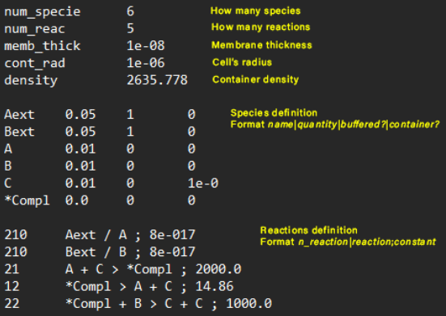

# Protocell's Simulation
Software to simulate the evolution of a protocell given its properties.
The protocell's features can be specified in a file having the following structure:




## How to Run
Synchronize with the pipenv environment. 
```sh
pipenv shell
pipenv sync
```

Start the simulation, event can be added by creating files in the 'eventi' folder.
```sh
python start.py
```

Also a generator for the chemsitry of a protocell is provided, it can be tuned by modifying the file 'generator_conf.txt'.
```sh
python chem_generator.py
```